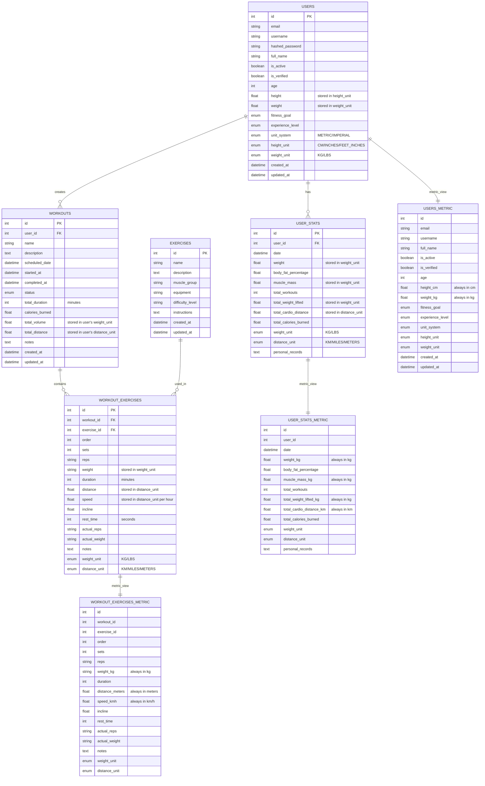

# WorkoutBuddy Architecture & Dependencies Diagram

## Overview

This document provides a holistic view of the WorkoutBuddy application architecture, showing the relationships between different components, services, and the dual unit system implementation.

## System Architecture

```mermaid
graph TB
    %% External Users
    User[👤 User] --> Mobile[Mobile App]
    User --> Web[Web Interface]

    %% Frontend Layer
    subgraph "Frontend Layer"
        Mobile --> MobileAPI[Mobile API Client]
        Web --> WebAPI[Web API Client]
    end

    %% API Gateway Layer
    subgraph "API Gateway Layer"
        Nginx[Nginx Reverse Proxy]
        MobileAPI --> Nginx
        WebAPI --> Nginx
    end

    %% Backend Services
    subgraph "Backend Services"
        subgraph "Main Backend (FastAPI)"
            MainAPI[Main API Server]
            AuthService[Authentication Service]
            UserService[User Management Service]
            WorkoutService[Workout Service]
            ExerciseService[Exercise Service]
            StatsService[Statistics Service]
        end

        subgraph "ML Service (FastAPI)"
            MLAPI[ML API Server]
            UserSimilarityModel[User Similarity Model]
            ExerciseRecommender[Exercise Recommender]
            AIServices[AI Services]
        end
    end

    %% Database Layer
    subgraph "Database Layer"
        PostgreSQL[(PostgreSQL Database)]

        subgraph "Database Views"
            UsersMetric[users_metric View]
            UserStatsMetric[user_stats_metric View]
            WorkoutExercisesMetric[workout_exercises_metric View]
        end

        subgraph "Unit Conversion Functions"
            LbsToKg[lbs_to_kg()]
            KgToLbs[kg_to_lbs()]
            InchesToCm[inches_to_cm()]
            CmToInches[cm_to_inches()]
            MilesToKm[miles_to_km()]
            KmToMiles[km_to_miles()]
        end
    end

    %% Data Flow
    Nginx --> MainAPI
    Nginx --> MLAPI

    MainAPI --> AuthService
    MainAPI --> UserService
    MainAPI --> WorkoutService
    MainAPI --> ExerciseService
    MainAPI --> StatsService

    MLAPI --> UserSimilarityModel
    MLAPI --> ExerciseRecommender
    MLAPI --> AIServices

    %% Database Connections
    MainAPI --> PostgreSQL
    MLAPI --> PostgreSQL

    %% Unit System Integration
    UserService --> UnitConverter[Unit Conversion Utils]
    WorkoutService --> UnitConverter
    StatsService --> UnitConverter

    UserSimilarityModel --> UsersMetric
    UserSimilarityModel --> UserStatsMetric
    ExerciseRecommender --> WorkoutExercisesMetric
```

## Component Dependencies


## Data Flow with Unit System


## Database Schema with Unit Support



## Service Dependencies


## Unit System Integration Points


## Key Features of the Architecture

### 1. **Dual Unit Support**
- **User Preferences**: Users can choose between metric and imperial units
- **Storage**: Data is stored in user's preferred units
- **Processing**: All algorithms use metric units internally
- **Display**: Results are converted back to user's preferred units

### 2. **Metric Views**
- **Automatic Conversion**: Database views automatically convert units to metric
- **Algorithm Access**: ML models access data through metric views
- **Performance**: Fast access to converted data without application-level conversion

### 3. **Unit Conversion Functions**
- **Database Level**: PostgreSQL functions for efficient conversion
- **Application Level**: Python utilities for conversion and formatting
- **Validation**: Unit-specific range validation

### 4. **Service Separation**
- **Main Backend**: Handles user management, workouts, and statistics
- **ML Service**: Handles recommendations and similarity calculations
- **Shared Models**: Common data models with unit support

### 5. **API Design**
- **Dual Schemas**: Regular schemas for user input/output, metric schemas for algorithms
- **Unit Validation**: Input validation based on unit type
- **Flexible Display**: Support for different unit preferences

## Benefits of This Architecture

1. **User Experience**: Users work in their preferred units
2. **Algorithm Consistency**: All ML algorithms use metric units
3. **Data Integrity**: Original units are preserved
4. **Performance**: Efficient unit conversion at database level
5. **Maintainability**: Clear separation of concerns
6. **Scalability**: Microservice architecture supports independent scaling
7. **Flexibility**: Easy to add new units or conversion factors

## Deployment Architecture


This architecture provides a comprehensive view of how the dual unit system integrates with all components of the WorkoutBuddy application, ensuring consistency, performance, and user satisfaction.