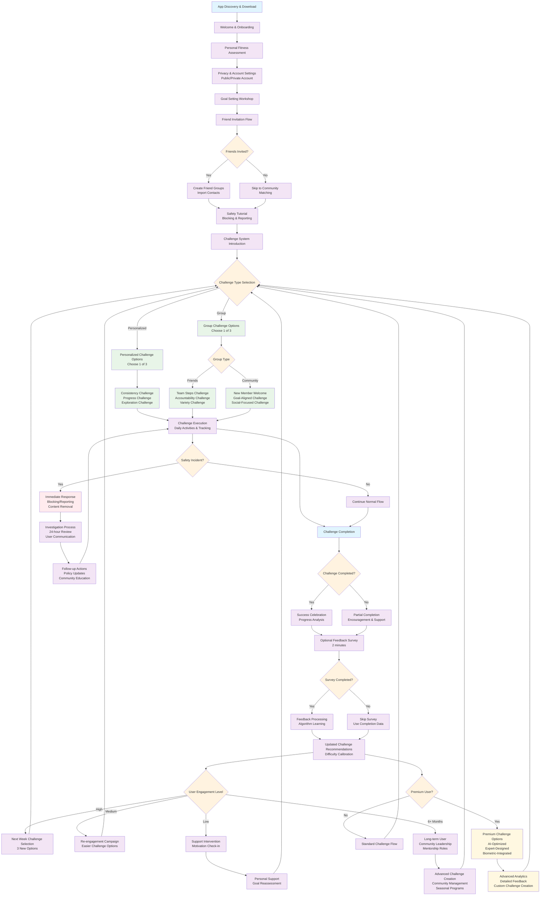

# **Updated Detailed Customer Journey Instructions**

## **Phase 1: Discovery & Awareness (Days 1-7)**

### **Entry Points & Acquisition**
**Organic Discovery:**
- User discovers app through App Store search for "fitness accountability" or "workout buddy"
- **Friend invitations** from existing users with personalized invite links
- Social media content showing community success stories
- Word-of-mouth referrals from existing community members
- Corporate wellness program introduction

**Paid Acquisition:**
- Targeted ads on fitness/wellness content (YouTube fitness channels, Instagram fitness influencers)
- Google Ads for keywords: "fitness motivation," "workout accountability," "fitness community"
- Partnerships with fitness influencers for authentic endorsements

### **Initial App Store Experience**
**Optimized Listing:**
- Screenshots showing real community interactions (anonymized)
- Video preview demonstrating friend invitation and matching process
- Reviews highlighting specific success stories
- Clear value proposition: "Find Your Fitness Tribe"

## **Phase 2: Onboarding & Goal Setting (Days 1-14)**

### **Day 1: First App Launch**

**Welcome Flow (7-10 minutes):**
1. **Personal Fitness Assessment**
   - Current fitness level (beginner/intermediate/advanced)
   - Primary goals (weight loss, strength, endurance, wellness)
   - Available time commitment (15min/30min/60min+ daily)
   - Preferred workout types and times

2. **Privacy & Account Settings**
   - **Account Type Selection**: Choose between Public (discoverable by all users) or Private (only visible to invited friends and matched communities)
   - Privacy preferences for sharing progress photos/metrics
   - Notification preferences
   - Safety and blocking controls introduction

3. **Social Comfort Level Quiz**
   - Preference for accountability vs competition
   - Comfort with sharing progress photos/metrics
   - Interest in virtual vs local connections
   - Communication style preferences

4. **Goal Setting Workshop**
   - SMART goal framework with guided questions
   - Timeline selection with milestone suggestions
   - Choose 1 primary goal to start (prevent overwhelm)
   - Set up basic tracking preferences

**Immediate Value Delivery:**
- Personalized 7-day starter challenge based on their goal
- **Friend invitation feature introduction** with easy sharing options
- First workout/activity suggestion they can complete immediately

### **Days 2-7: Foundation Building & Friend Network**

**Progressive Feature Introduction:**
- **Day 2:** Complete first guided workout/activity, log first progress entry
- **Day 3:** **Friend invitation flow** - Import contacts, share invite links, send personalized invitations
- **Day 4:** Introduction to challenge system with personal daily challenge
- **Day 5:** **Safety tutorial** including blocking, reporting, and privacy controls
- **Day 6:** Preview of community matching system (without connecting yet)
- **Day 7:** Choose between friend-first or community matching approach

**Friend Invitation System:**
- **Multiple invitation methods**: SMS, email, social media sharing, QR code
- **Personalized invite messages**: "Join me on [AppName] to achieve our fitness goals together!"
- **Friend dashboard**: See invited friends' status (pending, joined, active)
- **Group creation**: Create private workout groups with invited friends
- **Mutual friend suggestions**: Show when friends-of-friends join

**Engagement Hooks:**
- Daily check-in notifications (not overwhelming - max 1 per day)
- Progress visualization showing week 1 improvements
- Educational content about habit formation and accountability science
- **Friend activity notifications**: When invited friends join or complete workouts

### **Days 8-14: Community Introduction & Network Building**

**Friend Network First (If friends invited):**
- **Private friend groups**: Start workout challenges with invited friends
- **Friend accountability features**: Check-in reminders, progress sharing, encouragement messaging
- **Group goal setting**: Collaborative goal creation with friends
- **Safety within friend networks**: Blocking and reporting options even for friends

**Community Matching (Secondary or Primary):**
- **Intelligent matching based on**:
  - Goal compatibility
  - Fitness level alignment
  - Schedule compatibility
  - Geographic proximity (if location sharing enabled)
  - Personality/communication style fit
  - **Account type compatibility** (public users can match with anyone, private users only with invited connections initially)

**Trust & Safety Features:**
- **Blocking system**: One-tap block with immediate removal from all interactions
- **Reporting tools**: Easy reporting for inappropriate behavior, harassment, or spam
- **Profile verification**: Optional ID verification for enhanced trust
- **Safety guidelines**: Clear community standards and consequences

## **Phase 3: Habit Formation & Engagement (Weeks 3-8)**

### **Week 3-4: Routine Development**

**Daily Experience:**
- **Morning:** Check friend and community feed for motivation/updates (2-3 minutes)
- **Workout Time:** Complete planned activity with optional live check-ins with friends/community
- **Evening:** Log progress and engage with friend/community achievements (5 minutes)

**Weekly Experience:**
- **Monday:** New weekly challenge introduction with friends/community
- **Wednesday:** Mid-week motivation check-in and progress sharing
- **Friday:** Week reflection and celebration of wins
- **Sunday:** Planning session for upcoming week

**Enhanced Social Features:**
- **Friend vs. community toggle**: Switch between friend feed and broader community
- **Private messaging**: Direct communication with friends and matched partners
- **Group challenges**: Friends can create private challenges or join community ones
- **Safety monitoring**: AI-powered detection of concerning messages or behavior

### **Week 5-8: Deeper Community Integration**

**Advanced Social Features:**
- **Friend network expansion**: Friends can introduce their fitness friends
- **Community leadership roles**: Become group moderators or challenge leaders
- **Cross-pollination**: Private group members can selectively join community features
- **Advanced blocking options**: Block specific types of content or interaction

**Privacy Controls Evolution:**
- **Granular sharing settings**: Choose what to share with friends vs. community
- **Activity visibility**: Control who sees workout details, locations, photos
- **Profile customization**: Different profile views for friends vs. community matches
- **Data portability**: Export friend connections and workout history

## **Phase 4: Conversion & Premium Experience (Weeks 6-12)**

### **Premium Social Features**
- **Priority friend matching**: Help friends find other users faster
- **Advanced group features**: Video calls, shared workout libraries, custom challenges
- **Enhanced privacy controls**: More granular permissions and blocking options
- **Cross-platform integration**: Connect with friends on other fitness platforms

### **Safety & Moderation Premium**
- **Enhanced verification**: Priority verification for premium users
- **Advanced reporting**: More detailed reporting options and faster response
- **Community management tools**: For users who become group leaders
- **Direct support access**: Priority customer support for safety issues

## **Phase 5: Long-term Retention & Advocacy (Months 3+)**

### **Friend Network Expansion**
- **Referral rewards**: Benefits for bringing new friends to platform
- **Network effects**: Value increases as more friends join
- **Alumni networks**: Connect with friends who've achieved similar goals
- **Mentorship matching**: Experienced friends mentor newcomers

### **Community Leadership**
- **Verified community leaders**: Trusted users with enhanced moderation abilities
- **Safety ambassadors**: Users who help maintain community standards
- **Event organization**: Plan real-world meetups and virtual events
- **Content creation**: Share workout routines and motivational content

## **Critical Safety & Privacy Touchpoints**

### **Blocking & Reporting System**
**Immediate Actions:**
- **One-tap blocking**: Instant removal from all interactions
- **Automatic content filtering**: Hide all past and future content from blocked users
- **Network blocking**: Option to block user's extended network
- **Report with context**: Specific reporting categories (harassment, inappropriate content, spam)

**Progressive Enforcement:**
- **Warning system**: Graduated responses for minor violations
- **Temporary restrictions**: Limited functionality for repeat offenders
- **Account suspension**: Temporary removal for serious violations
- **Permanent bans**: For severe or repeated safety violations

### **Privacy Control Evolution**
**Onboarding Privacy Settings:**
- Account visibility (public/private)
- Data sharing preferences
- Location sharing controls
- Photo/progress sharing permissions

**Advanced Privacy Features:**
- **Selective visibility**: Different privacy levels for different user groups
- **Content expiration**: Temporary posts that auto-delete
- **Anonymous mode**: Participate in challenges without profile visibility
- **Data audit trail**: See who has accessed your information

### **Account Types Management**

**Public Accounts:**
- Discoverable by all users
- Can be invited to any community
- Profile visible in search results
- Can initiate contact with any user

**Private Accounts:**
- Only visible to friends and invited connections
- Require invitation or friend introduction to join communities
- Not discoverable in general search
- Can only be contacted by connected users

**Hybrid Options:**
- **Semi-private**: Discoverable but require approval to connect
- **Community-only**: Public in communities, private for direct messaging
- **Location-based privacy**: Different visibility in different geographic areas


## User journey diagram




## UX code based on ReactNative

```
import React, { useState } from 'react';
import { Home, Search, Target, Users, User, Heart, MessageCircle, Send, Bookmark, MoreHorizontal, Plus, Camera, Play, ChevronRight, Settings, Shield, Bell, Zap, Trophy, Calendar, TrendingUp, Star, X, Check, UserPlus, Share2, Crown, Award, Flame, Globe } from 'lucide-react';

const FitTribeApp = () => {
  const [currentTab, setCurrentTab] = useState('home');
  const [selectedCommunity, setSelectedCommunity] = useState(null);
  const [showCommunityModal, setShowCommunityModal] = useState(false);

  // Bottom Navigation Component
  const BottomNav = () => {
    const navItems = [
      { id: 'home', icon: Home, label: 'Home' },
      { id: 'search', icon: Search, label: 'Search' },
      { id: 'challenges', icon: Target, label: 'Challenges' },
      { id: 'communities', icon: Globe, label: 'Communities' },
      { id: 'profile', icon: User, label: 'Profile' },
    ];

    return (
      <div className="fixed bottom-0 left-0 right-0 bg-gray-900 border-t border-gray-800 px-4 py-2 max-w-sm mx-auto">
        <div className="flex justify-around">
          {navItems.map((item) => {
            const Icon = item.icon;
            const isActive = currentTab === item.id;
            return (
              <button
                key={item.id}
                onClick={() => setCurrentTab(item.id)}
                className={`flex flex-col items-center py-2 px-3 ${
                  isActive ? 'text-blue-400' : 'text-gray-500'
                }`}
              >
                <Icon size={24} className={isActive ? 'fill-current' : ''} />
                <span className="text-xs mt-1">{item.label}</span>
              </button>
            );
          })}
        </div>
      </div>
    );
  };

  // Stories Component
  const Stories = () => {
    const stories = [
      { id: 1, name: 'Your Story', image: '👤', hasStory: false },
      { id: 2, name: 'Sarah', image: '👩', hasStory: true },
      { id: 3, name: 'Mike', image: '👨', hasStory: true },
      { id: 4, name: 'Emma', image: '👩‍🦱', hasStory: true },
      { id: 5, name: 'Alex', image: '👨‍🦲', hasStory: true },
    ];

    return (
      <div className="flex space-x-4 px-4 py-3 overflow-x-auto">
        {stories.map((story) => (
          <div key={story.id} className="flex flex-col items-center flex-shrink-0">
            <div className={`relative w-16 h-16 rounded-full p-0.5 ${
              story.hasStory 
                ? 'bg-gradient-to-tr from-yellow-400 via-red-500 to-purple-500' 
                : 'bg-gray-700'
            }`}>
              <div className="w-full h-full bg-gray-800 rounded-full flex items-center justify-center text-2xl">
                {story.image}
              </div>
              {!story.hasStory && (
                <div className="absolute bottom-0 right-0 w-5 h-5 bg-blue-500 rounded-full flex items-center justify-center">
                  <Plus size={12} className="text-white" />
                </div>
              )}
            </div>
            <span className="text-xs text-gray-400 mt-1 text-center max-w-16 truncate">
              {story.name}
            </span>
          </div>
        ))}
      </div>
    );
  };

  // Feed Post Component
  const FeedPost = ({ post }) => {
    return (
      <div className="bg-gray-800 mb-4 border border-gray-700">
        {/* Post Header */}
        <div className="flex items-center justify-between px-4 py-3">
          <div className="flex items-center space-x-3">
            <div className="w-8 h-8 bg-gradient-to-tr from-blue-500 to-purple-500 rounded-full flex items-center justify-center text-white font-bold text-sm">
              {post.user.charAt(0)}
            </div>
            <div>
              <p className="text-sm font-semibold text-white">{post.user}</p>
              <p className="text-xs text-gray-400">{post.location}</p>
            </div>
          </div>
          <MoreHorizontal size={20} className="text-gray-400" />
        </div>

        {/* Post Content */}
        <div className="px-4 mb-3">
          <p className="text-sm text-gray-200">{post.content}</p>
          {post.challenge && (
            <div className="mt-2 p-3 bg-gradient-to-r from-blue-900/50 to-purple-900/50 rounded-lg border border-blue-800/50">
              <div className="flex items-center space-x-2">
                <Target size={16} className="text-blue-400" />
                <span className="text-sm font-medium text-blue-300">{post.challenge}</span>
              </div>
            </div>
          )}
          {post.community && (
            <div className="mt-2 p-3 bg-gradient-to-r from-green-900/50 to-blue-900/50 rounded-lg border border-green-800/50">
              <div className="flex items-center space-x-2">
                <Globe size={16} className="text-green-400" />
                <span className="text-sm font-medium text-green-300">{post.community}</span>
              </div>
            </div>
          )}
        </div>

        {/* Post Image/Activity */}
        <div className="bg-gradient-to-br from-gray-700 to-gray-800 aspect-square mx-4 rounded-lg flex items-center justify-center mb-3">
          <div className="text-center">
            <div className="text-4xl mb-2">{post.activityIcon}</div>
            <p className="text-sm font-medium text-gray-200">{post.activity}</p>
            <p className="text-xs text-gray-400">{post.duration}</p>
          </div>
        </div>

        {/* Post Actions */}
        <div className="px-4 pb-3">
          <div className="flex items-center justify-between mb-2">
            <div className="flex space-x-4">
              <Heart size={24} className="text-gray-400 hover:text-red-500 cursor-pointer transition-colors" />
              <MessageCircle size={24} className="text-gray-400 hover:text-blue-400 cursor-pointer transition-colors" />
              <Send size={24} className="text-gray-400 hover:text-blue-400 cursor-pointer transition-colors" />
            </div>
            <Bookmark size={24} className="text-gray-400 hover:text-yellow-400 cursor-pointer transition-colors" />
          </div>
          
          <p className="text-sm font-semibold text-white mb-1">{post.likes} likes</p>
          <p className="text-xs text-gray-400">{post.time}</p>
        </div>
      </div>
    );
  };

  // Community Card Component
  const CommunityCard = ({ community, onJoin }) => {
    const memberAvatars = community.topMembers.map((member, index) => (
      <div key={index} className={`w-6 h-6 bg-gradient-to-tr from-blue-500 to-purple-500 rounded-full flex items-center justify-center text-white text-xs font-bold ${index > 0 ? '-ml-2' : ''}`}>
        {member.charAt(0)}
      </div>
    ));

    return (
      <div className="bg-gray-800 rounded-2xl p-6 border border-gray-700 hover:border-gray-600 transition-all">
        <div className="flex items-start justify-between mb-4">
          <div className="flex-1">
            <div className="flex items-center space-x-2 mb-2">
              <h3 className="text-lg font-bold text-white">{community.name}</h3>
              {community.isOfficial && (
                <Award size={16} className="text-yellow-400" />
              )}
            </div>
            <p className="text-sm text-gray-300 leading-relaxed mb-3">{community.description}</p>
            
            <div className="flex items-center space-x-4 text-sm text-gray-400">
              <div className="flex items-center space-x-1">
                <Users size={14} />
                <span>{community.memberCount} members</span>
              </div>
              <div className="flex items-center space-x-1">
                <TrendingUp size={14} />
                <span>{community.activityLevel}</span>
              </div>
              {community.challengeActive && (
                <div className="flex items-center space-x-1">
                  <Flame size={14} className="text-orange-400" />
                  <span className="text-orange-400">Active Challenge</span>
                </div>
              )}
            </div>
          </div>
        </div>
        
        <div className="flex items-center justify-between mb-4">
          <div className="flex items-center">
            <div className="flex">
              {memberAvatars}
            </div>
            <span className="text-xs text-gray-400 ml-2">Active members</span>
          </div>
          {community.isLeader && (
            <div className="flex items-center space-x-1 bg-yellow-900/30 px-2 py-1 rounded-full">
              <Crown size={12} className="text-yellow-400" />
              <span className="text-xs text-yellow-400">Leader</span>
            </div>
          )}
        </div>
        
        <button 
          onClick={() => onJoin(community)}
          className={`w-full font-medium py-3 rounded-xl transition-all ${
            community.isJoined 
              ? 'bg-gray-700 text-gray-300 hover:bg-gray-600'
              : 'bg-gradient-to-r from-blue-600 to-purple-600 text-white hover:shadow-lg'
          }`}
        >
          {community.isJoined ? 'Joined' : 'Join Community'}
        </button>
      </div>
    );
  };

  // Home Tab
  const HomeTab = () => {
    const feedPosts = [
      {
        id: 1,
        user: 'Sarah Johnson',
        location: 'Morning Workout',
        content: 'Just crushed day 5 of the Strength Building challenge! 💪 Feeling stronger every day.',
        challenge: '7-Day Strength Builder',
        community: 'Strength Warriors',
        activityIcon: '🏋️‍♀️',
        activity: 'Strength Training',
        duration: '45 min',
        likes: '23',
        time: '2 hours ago'
      },
      {
        id: 2,
        user: 'Mike Chen',
        location: 'Central Park',
        content: 'Beautiful morning for a run! Anyone want to join tomorrow? 🌅',
        challenge: 'Daily Movement Challenge',
        community: 'Early Birds',
        activityIcon: '🏃‍♂️',
        activity: 'Morning Run',
        duration: '30 min',
        likes: '18',
        time: '4 hours ago'
      }
    ];

    return (
      <div className="pb-20 bg-gray-900 min-h-screen">
        {/* Header */}
        <div className="bg-gray-900 px-4 py-3 flex items-center justify-between border-b border-gray-800">
          <h1 className="text-2xl font-bold bg-gradient-to-r from-blue-400 to-purple-400 bg-clip-text text-transparent">
            FitTribe
          </h1>
          <div className="flex space-x-4">
            <Heart size={24} className="text-gray-400" />
            <Send size={24} className="text-gray-400" />
          </div>
        </div>

        {/* Stories */}
        <Stories />

        {/* Quick Stats */}
        <div className="px-4 py-3">
          <div className="bg-gradient-to-r from-blue-600 to-purple-600 rounded-2xl p-4 text-white">
            <div className="flex items-center justify-between">
              <div>
                <h3 className="text-lg font-bold mb-1">Today's Progress</h3>
                <p className="text-blue-100 text-sm">Keep the momentum going! 🔥</p>
              </div>
              <div className="text-right">
                <div className="text-2xl font-bold">3/5</div>
                <div className="text-xs text-blue-100">goals completed</div>
              </div>
            </div>
            
            <div className="mt-4 bg-white bg-opacity-20 rounded-full h-2">
              <div className="bg-white h-2 rounded-full" style={{width: '60%'}}></div>
            </div>
          </div>
        </div>

        {/* Communities Quick Access */}
        <div className="px-4 py-3">
          <div className="flex items-center justify-between mb-3">
            <h2 className="text-lg font-bold text-white">Your Communities</h2>
            <button 
              onClick={() => setCurrentTab('communities')}
              className="text-blue-400 text-sm font-medium"
            >
              See all
            </button>
          </div>
          <div className="flex space-x-3 overflow-x-auto">
            {[
              { name: 'Strength Warriors', members: '2.1k', active: true },
              { name: 'Early Birds', members: '1.5k', active: false },
              { name: 'Yoga Masters', members: '3.2k', active: true }
            ].map((community, index) => (
              <div key={index} className="flex-shrink-0 bg-gray-800 rounded-xl p-3 border border-gray-700 min-w-32">
                <div className="flex items-center space-x-2 mb-1">
                  <Globe size={14} className="text-blue-400" />
                  {community.active && <div className="w-2 h-2 bg-green-400 rounded-full"></div>}
                </div>
                <h3 className="text-sm font-semibold text-white truncate">{community.name}</h3>
                <p className="text-xs text-gray-400">{community.members}</p>
              </div>
            ))}
          </div>
        </div>

        {/* Feed */}
        <div className="space-y-0">
          {feedPosts.map(post => (
            <FeedPost key={post.id} post={post} />
          ))}
        </div>
      </div>
    );
  };

  // Communities Tab
  const CommunitiesTab = () => {
    const [activeFilter, setActiveFilter] = useState('all');
    
    const communities = [
      {
        id: 1,
        name: 'Strength Warriors',
        description: 'Building strength together through structured workouts and progressive overload training.',
        memberCount: '2.1k',
        activityLevel: 'Very Active',
        isJoined: true,
        isOfficial: true,
        isLeader: false,
        challengeActive: true,
        topMembers: ['Sarah', 'Mike', 'Emma', 'Alex'],
        category: 'strength'
      },
      {
        id: 2,
        name: 'Early Birds',
        description: 'Morning workout enthusiasts who believe the early bird catches the gains!',
        memberCount: '1.5k',
        activityLevel: 'Active',
        isJoined: true,
        isOfficial: false,
        isLeader: true,
        challengeActive: false,
        topMembers: ['John', 'Lisa', 'Tom'],
        category: 'cardio'
      },
      {
        id: 3,
        name: 'Yoga Masters',
        description: 'Find your zen and flexibility through daily yoga practice and mindfulness.',
        memberCount: '3.2k',
        activityLevel: 'Moderate',
        isJoined: false,
        isOfficial: true,
        isLeader: false,
        challengeActive: true,
        topMembers: ['Maya', 'David', 'Sophie', 'Ryan'],
        category: 'wellness'
      },
      {
        id: 4,
        name: 'HIIT Squad',
        description: 'High-intensity interval training for maximum results in minimum time.',
        memberCount: '987',
        activityLevel: 'Very Active',
        isJoined: false,
        isOfficial: false,
        isLeader: false,
        challengeActive: true,
        topMembers: ['Chris', 'Nina', 'Max'],
        category: 'hiit'
      }
    ];

    const filters = [
      { id: 'all', label: 'All', count: communities.length },
      { id: 'joined', label: 'Joined', count: communities.filter(c => c.isJoined).length },
      { id: 'strength', label: 'Strength', count: communities.filter(c => c.category === 'strength').length },
      { id: 'cardio', label: 'Cardio', count: communities.filter(c => c.category === 'cardio').length },
      { id: 'wellness', label: 'Wellness', count: communities.filter(c => c.category === 'wellness').length }
    ];

    const filteredCommunities = communities.filter(community => {
      if (activeFilter === 'all') return true;
      if (activeFilter === 'joined') return community.isJoined;
      return community.category === activeFilter;
    });

    return (
      <div className="pb-20 bg-gray-900 min-h-screen">
        {/* Header */}
        <div className="bg-gray-900 px-4 py-4 border-b border-gray-800">
          <div className="flex items-center justify-between mb-3">
            <h1 className="text-xl font-bold text-white">Communities</h1>
            <button className="bg-blue-600 text-white p-2 rounded-xl">
              <Plus size={20} />
            </button>
          </div>
          <p className="text-sm text-gray-400">Connect with like-minded fitness enthusiasts</p>
        </div>

        {/* Filter Tabs */}
        <div className="px-4 py-3">
          <div className="flex space-x-2 overflow-x-auto">
            {filters.map((filter) => (
              <button
                key={filter.id}
                onClick={() => setActiveFilter(filter.id)}
                className={`px-4 py-2 rounded-xl text-sm font-medium whitespace-nowrap transition-all ${
                  activeFilter === filter.id
                    ? 'bg-blue-600 text-white'
                    : 'bg-gray-800 text-gray-400 hover:bg-gray-700'
                }`}
              >
                {filter.label} ({filter.count})
              </button>
            ))}
          </div>
        </div>

        {/* My Communities Stats */}
        {activeFilter === 'joined' && (
          <div className="px-4 mb-4">
            <div className="bg-gradient-to-r from-green-600 to-blue-600 rounded-2xl p-4 text-white">
              <div className="flex items-center justify-between mb-3">
                <h3 className="text-lg font-bold">Your Impact</h3>
                <Trophy size={24} className="text-yellow-300" />
              </div>
              <div className="grid grid-cols-3 gap-4 text-center">
                <div>
                  <div className="text-xl font-bold">2</div>
                  <div className="text-xs text-green-100">Communities</div>
                </div>
                <div>
                  <div className="text-xl font-bold">1</div>
                  <div className="text-xs text-green-100">Leadership Role</div>
                </div>
                <div>
                  <div className="text-xl font-bold">47</div>
                  <div className="text-xs text-green-100">Contributions</div>
                </div>
              </div>
            </div>
          </div>
        )}

        {/* Communities List */}
        <div className="px-4">
          <div className="space-y-4">
            {filteredCommunities.map(community => (
              <CommunityCard 
                key={community.id} 
                community={community}
                onJoin={(community) => {
                  // Handle join/leave community
                  console.log('Joining community:', community.name);
                }}
              />
            ))}
          </div>
          
          {filteredCommunities.length === 0 && (
            <div className="text-center py-12">
              <Globe size={48} className="text-gray-600 mx-auto mb-4" />
              <h3 className="text-lg font-semibold text-gray-300 mb-2">No communities found</h3>
              <p className="text-gray-500 text-sm">Try adjusting your filters or create a new community</p>
            </div>
          )}
        </div>

        {/* Create Community CTA */}
        <div className="px-4 mt-6">
          <div className="bg-gray-800 rounded-xl p-4 border border-gray-700 text-center">
            <Plus size={24} className="text-blue-400 mx-auto mb-2" />
            <h3 className="font-semibold text-white mb-1">Start Your Own Community</h3>
            <p className="text-sm text-gray-400 mb-3">
              Create a space for your fitness passion
            </p>
            <button className="bg-gradient-to-r from-blue-600 to-purple-600 text-white px-6 py-2 rounded-xl text-sm font-medium">
              Create Community
            </button>
          </div>
        </div>
      </div>
    );
  };

  // Search Tab
  const SearchTab = () => {
    const [searchText, setSearchText] = useState('');
    
    const suggestedUsers = [
      { name: 'Emma Wilson', activity: 'Yoga enthusiast', mutual: '3 mutual friends', community: 'Yoga Masters' },
      { name: 'David Kim', activity: 'Running coach', mutual: '5 mutual friends', community: 'Early Birds' },
      { name: 'Lisa Garcia', activity: 'Strength training', mutual: '2 mutual friends', community: 'Strength Warriors' },
    ];

    const trendingChallenges = [
      { name: '30-Day Yoga Journey', participants: '2.4k', trending: true, community: 'Yoga Masters' },
      { name: 'Summer Body Prep', participants: '1.8k', trending: true, community: 'HIIT Squad' },
      { name: 'Mindful Movement', participants: '956', trending: false, community: 'Wellness Warriors' },
    ];

    return (
      <div className="pb-20 bg-gray-900 min-h-screen">
        {/* Header */}
        <div className="bg-gray-900 px-4 py-3 border-b border-gray-800">
          <h1 className="text-xl font-bold text-white mb-3">Discover</h1>
          <div className="relative">
            <Search size={18} className="absolute left-3 top-3 text-gray-500" />
            <input
              type="text"
              placeholder="Search users, challenges, communities..."
              value={searchText}
              onChange={(e) => setSearchText(e.target.value)}
              className="w-full bg-gray-800 text-white placeholder-gray-500 rounded-xl pl-10 pr-4 py-3 text-sm focus:outline-none focus:ring-2 focus:ring-blue-500 border border-gray-700 focus:border-transparent transition-all"
            />
          </div>
        </div>

        <div className="px-4 py-4 space-y-6">
          {/* Suggested People */}
          <div>
            <h2 className="text-lg font-bold text-white mb-3">Suggested for you</h2>
            <div className="space-y-3">
              {suggestedUsers.map((user, index) => (
                <div key={index} className="bg-gray-800 rounded-xl p-4 border border-gray-700">
                  <div className="flex items-center justify-between">
                    <div className="flex items-center space-x-3">
                      <div className="w-12 h-12 bg-gradient-to-tr from-blue-500 to-purple-500 rounded-full flex items-center justify-center text-white font-bold">
                        {user.name.charAt(0)}
                      </div>
                      <div className="flex-1">
                        <p className="font-semibold text-white">{user.name}</p>
                        <p className="text-xs text-gray-400">{user.activity}</p>
                        <div className="flex items-center space-x-2 mt-1">
                          <p className="text-xs text-gray-500">{user.mutual}</p>
                          <span className="text-gray-600">•</span>
                          <div className="flex items-center space-x-1">
                            <Globe size={10} className="text-blue-400" />
                            <span className="text-xs text-blue-400">{user.community}</span>
                          </div>
                        </div>
                      </div>
                    </div>
                    <button className="bg-blue-600 text-white px-4 py-1.5 rounded-lg text-sm font-medium hover:bg-blue-700 transition-colors">
                      Follow
                    </button>
                  </div>
                </div>
              ))}
            </div>
          </div>

          {/* Trending Challenges */}
          <div>
            <h2 className="text-lg font-bold text-white mb-3">Trending Challenges</h2>
            <div className="space-y-3">
              {trendingChallenges.map((challenge, index) => (
                <div key={index} className="bg-gray-800 rounded-xl p-4 border border-gray-700">
                  <div className="flex items-center justify-between">
                    <div className="flex-1">
                      <div className="flex items-center space-x-2 mb-1">
                        <h3 className="font-semibold text-white">{challenge.name}</h3>
                        {challenge.trending && (
                          <span className="bg-red-500 text-white text-xs px-2 py-0.5 rounded-full">
                            Trending
                          </span>
                        )}
                      </div>
                      <p className="text-sm text-gray-400 mb-1">{challenge.participants} participants</p>
                      <div className="flex items-center space-x-1">
                        <Globe size={12} className="text-green-400" />
                        <span className="text-xs text-green-400">{challenge.community}</span>
                      </div>
                    </div>
                    <ChevronRight size={20} className="text-gray-500" />
                  </div>
                </div>
              ))}
            </div>
          </div>

          {/* Trending Communities */}
          <div>
            <h2 className="text-lg font-bold text-white mb-3">Trending Communities</h2>
            <div className="grid grid-cols-2 gap-3">
              {[
                { name: 'HIIT Squad', members: '987', growth: '+12%' },
                { name: 'Mindful Movers', members: '1.2k', growth: '+8%' },
                { name: 'Bodyweight Bros', members: '743', growth: '+15%' },
                { name: 'Flexibility Focus', members: '1.8k', growth: '+5%' }
              ].map((community, index) => (
                <div key={index} className="bg-gray-800 rounded-xl p-3 border border-gray-700">
                  <div className="flex items-center space-x-2 mb-2">
                    <Globe size={16} className="text-blue-400" />
                    <TrendingUp size={14} className="text-green-400" />
                  </div>
                  <h3 className="font-semibold text-white text-sm mb-1">{community.name}</h3>
                  <div className="flex items-center justify-between text-xs">
                    <span className="text-gray-400">{community.members}</span>
                    <span className="text-green-400">{community.growth}</span>
                  </div>
                </div>
              ))}
            </div>
          </div>
        </div>
      </div>
    );
  };

  // Challenges Tab (Updated)
  const ChallengesTab = () => {
    const challenges = [
      {
        id: 1,
        title: "7-Day Movement Starter",
        description: "Complete any 15-minute activity for 7 consecutive days. Perfect for building consistency.",
        difficulty: "Accessible",
        successRate: 78,
        duration: "1 week",
        participants: "2.1k",
        reasoning: "High success rate and builds sustainable habits",
        community: "Movement Makers"
      },
      {
        id: 2,
        title: "Strength Foundation",
        description: "3 strength workouts + 2 active recovery days. Build your base strength progressively.",
        difficulty: "Stretch",
        successRate: 65,
        duration: "2 weeks",
        participants: "1.5k",
        reasoning: "Perfect progression from your last challenge",
        community: "Strength Warriors"
      },
      {
        id: 3,
        title: "Complete Transformation",
        description: "Daily workouts + nutrition tracking + mindfulness. Comprehensive lifestyle change.",
        difficulty: "Ambitious",
        successRate: 42,
        duration: "4 weeks",
        participants: "892",
        reasoning: "Ready for a complete lifestyle transformation",
        community: "Elite Performers"
      }
    ];

    const ChallengeCard = ({ challenge }) => {
      const difficultyColors = {
        'Accessible': 'from-green-400 to-green-600',
        'Stretch': 'from-yellow-400 to-orange-500',
        'Ambitious': 'from-red-400 to-pink-600'
      };

      return (
        <div className="bg-gray-800 rounded-2xl p-6 border border-gray-700 hover:border-gray-600 transition-all">
          <div className="flex items-start justify-between mb-4">
            <div className="flex-1">
              <h3 className="text-lg font-bold text-white mb-2">{challenge.title}</h3>
              <p className="text-sm text-gray-300 leading-relaxed">{challenge.description}</p>
            </div>
            <div className={`px-3 py-1 rounded-full bg-gradient-to-r ${difficultyColors[challenge.difficulty]} text-white text-xs font-medium ml-4`}>
              {challenge.difficulty}
            </div>
          </div>
          
          <div className="flex items-center space-x-4 mb-4">
            <div className="flex items-center space-x-1 text-sm text-gray-400">
              <Calendar size={14} />
              <span>{challenge.duration}</span>
            </div>
            <div className="flex items-center space-x-1 text-sm text-gray-400">
              <TrendingUp size={14} />
              <span>{challenge.successRate}% success</span>
            </div>
            <div className="flex items-center space-x-1 text-sm text-gray-400">
              <Users size={14} />
              <span>{challenge.participants}</span>
            </div>
          </div>

          {/* Community Badge */}
          <div className="bg-blue-900/50 rounded-lg p-2 mb-4 border border-blue-800/50">
            <div className="flex items-center space-x-2">
              <Globe size={14} className="text-blue-400" />
              <span className="text-sm text-blue-300">Join {challenge.community} community</span>
            </div>
          </div>
          
          <div className="bg-gray-700/50 rounded-lg p-3 mb-4">
            <p className="text-xs text-gray-300 leading-relaxed">
              <span className="font-medium text-blue-400">Perfect for you:</span> {challenge.reasoning}
            </p>
          </div>
          
          <button className="w-full bg-gradient-to-r from-blue-600 to-purple-600 text-white font-medium py-3 rounded-xl hover:shadow-lg transition-all">
            Join Challenge
          </button>
        </div>
      );
    };

    return (
      <div className="pb-20 bg-gray-900 min-h-screen">
        {/* Header */}
        <div className="bg-gray-900 px-4 py-4 border-b border-gray-800">
          <div className="flex items-center justify-between mb-3">
            <h1 className="text-xl font-bold text-white">Challenges</h1>
            <button className="bg-blue-600 text-white p-2 rounded-xl">
              <Plus size={20} />
            </button>
          </div>
          <p className="text-sm text-gray-400">Personalized challenges with community support</p>
        </div>

        {/* Active Challenge */}
        <div className="px-4 py-4">
          <div className="bg-gradient-to-r from-green-600 to-blue-600 rounded-2xl p-4 text-white mb-6">
            <div className="flex items-center justify-between mb-3">
              <h3 className="text-lg font-bold">Current Challenge</h3>
              <div className="text-2xl">🔥</div>
            </div>
            <h4 className="font-semibold mb-2">7-Day Movement Starter</h4>
            <div className="flex items-center space-x-2 mb-3">
              <p className="text-green-100 text-sm">Day 5 of 7 • You're crushing it!</p>
              <div className="flex items-center space-x-1">
                <Globe size={12} className="text-green-200" />
                <span className="text-xs text-green-200">Movement Makers</span>
              </div>
            </div>
            
            <div className="bg-white bg-opacity-20 rounded-full h-2 mb-3">
              <div className="bg-white h-2 rounded-full" style={{width: '71%'}}></div>
            </div>
            
            <div className="flex items-center justify-between text-sm">
              <span>5/7 days completed</span>
              <span>2 days left</span>
            </div>
          </div>
        </div>

        {/* Recommended Challenges */}
        <div className="px-4">
          <h2 className="text-lg font-bold text-white mb-4">Recommended for you</h2>
          <div className="space-y-4">
            {challenges.map(challenge => (
              <ChallengeCard key={challenge.id} challenge={challenge} />
            ))}
          </div>
        </div>
      </div>
    );
  };

  // Friends Tab (Updated for dark theme)
  const FriendsTab = () => {
    const friends = [
      { name: 'Sarah Johnson', status: 'Completed workout', time: '2h', streak: 12, online: true, community: 'Strength Warriors' },
      { name: 'Mike Chen', status: 'Started new challenge', time: '4h', streak: 8, online: true, community: 'Early Birds' },
      { name: 'Emma Wilson', status: 'Rest day', time: '1d', streak: 15, online: false, community: 'Yoga Masters' },
      { name: 'David Kim', status: 'Morning run', time: '3h', streak: 22, online: false, community: 'Running Club' },
    ];

    return (
      <div className="pb-20 bg-gray-900 min-h-screen">
        {/* Header */}
        <div className="bg-gray-900 px-4 py-4 border-b border-gray-800">
          <div className="flex items-center justify-between mb-3">
            <h1 className="text-xl font-bold text-white">Friends</h1>
            <UserPlus size={24} className="text-gray-400" />
          </div>
          <p className="text-sm text-gray-400">{friends.length} fitness friends</p>
        </div>

        {/* Active Friends */}
        <div className="px-4 py-4">
          <div className="flex items-center space-x-3 mb-4">
            <div className="w-3 h-3 bg-green-500 rounded-full"></div>
            <span className="text-sm font-medium text-white">
              {friends.filter(f => f.online).length} friends active now
            </span>
          </div>

          <div className="space-y-3">
            {friends.map((friend, index) => (
              <div key={index} className="bg-gray-800 rounded-xl p-4 border border-gray-700">
                <div className="flex items-center justify-between">
                  <div className="flex items-center space-x-3">
                    <div className="relative">
                      <div className="w-12 h-12 bg-gradient-to-tr from-blue-500 to-purple-500 rounded-full flex items-center justify-center text-white font-bold">
                        {friend.name.charAt(0)}
                      </div>
                      {friend.online && (
                        <div className="absolute -bottom-1 -right-1 w-4 h-4 bg-green-500 rounded-full border-2 border-gray-800"></div>
                      )}
                    </div>
                    <div className="flex-1">
                      <p className="font-semibold text-white">{friend.name}</p>
                      <p className="text-sm text-gray-300">{friend.status}</p>
                      <div className="flex items-center space-x-3 mt-1">
                        <span className="text-xs text-gray-500">{friend.time} ago</span>
                        <div className="flex items-center space-x-1">
                          <Zap size={12} className="text-orange-400" />
                          <span className="text-xs text-gray-400">{friend.streak} day streak</span>
                        </div>
                        <div className="flex items-center space-x-1">
                          <Globe size={10} className="text-blue-400" />
                          <span className="text-xs text-blue-400">{friend.community}</span>
                        </div>
                      </div>
                    </div>
                  </div>
                  <div className="flex space-x-2">
                    <button className="p-2 bg-gray-700 rounded-xl hover:bg-gray-600 transition-colors">
                      <MessageCircle size={16} className="text-gray-300" />
                    </button>
                    <button className="p-2 bg-blue-900/50 rounded-xl border border-blue-800/50 hover:bg-blue-800/50 transition-colors">
                      <Target size={16} className="text-blue-400" />
                    </button>
                  </div>
                </div>
              </div>
            ))}
          </div>

          {/* Invite More Friends */}
          <div className="mt-6 bg-blue-900/30 rounded-xl p-4 border border-blue-800/50">
            <div className="text-center">
              <UserPlus size={24} className="text-blue-400 mx-auto mb-2" />
              <h3 className="font-semibold text-blue-300 mb-1">Invite more friends</h3>
              <p className="text-sm text-blue-400 mb-3">
                Friends make fitness 3x more effective
              </p>
              <button className="bg-gradient-to-r from-blue-600 to-purple-600 text-white px-6 py-2 rounded-xl text-sm font-medium">
                Invite Friends
              </button>
            </div>
          </div>
        </div>
      </div>
    );
  };

  // Profile Tab (Updated for dark theme)
  const ProfileTab = () => {
    const stats = [
      { label: 'Challenges', value: '12', icon: Target },
      { label: 'Streak', value: '15', icon: Zap },
      { label: 'Communities', value: '3', icon: Globe },
    ];

    const achievements = [
      { title: 'First Challenge', icon: '🎯', date: 'Jan 2025' },
      { title: 'Community Leader', icon: '👑', date: 'Jan 2025' },
      { title: 'Social Butterfly', icon: '🦋', date: 'Jan 2025' },
      { title: 'Consistent Creator', icon: '⚡', date: 'Jan 2025' },
    ];

    return (
      <div className="pb-20 bg-gray-900 min-h-screen">
        {/* Header */}
        <div className="bg-gray-900 px-4 py-4 border-b border-gray-800">
          <div className="flex items-center justify-between">
            <h1 className="text-xl font-bold text-white">Profile</h1>
            <div className="flex space-x-3">
              <Bell size={24} className="text-gray-400" />
              <Settings size={24} className="text-gray-400" />
            </div>
          </div>
        </div>

        <div className="px-4 py-6">
          {/* Profile Info */}
          <div className="text-center mb-6">
            <div className="w-24 h-24 bg-gradient-to-tr from-blue-500 to-purple-500 rounded-full flex items-center justify-center text-white text-3xl font-bold mx-auto mb-4">
              JD
            </div>
            <h2 className="text-xl font-bold text-white mb-1">John Doe</h2>
            <p className="text-gray-400 mb-3">Fitness enthusiast • Community Leader</p>
            
            <div className="flex justify-center space-x-6 mb-4">
              {stats.map((stat, index) => {
                const Icon = stat.icon;
                return (
                  <div key={index} className="text-center">
                    <div className="flex items-center justify-center space-x-1 mb-1">
                      <Icon size={16} className="text-gray-400" />
                      <span className="text-lg font-bold text-white">{stat.value}</span>
                    </div>
                    <span className="text-xs text-gray-500">{stat.label}</span>
                  </div>
                );
              })}
            </div>

            <button className="bg-gray-800 text-gray-200 px-6 py-2 rounded-xl text-sm font-medium border border-gray-700 hover:bg-gray-700 transition-colors">
              Edit Profile
            </button>
          </div>

          {/* Achievements */}
          <div className="mb-6">
            <h3 className="text-lg font-bold text-white mb-3">Achievements</h3>
            <div className="grid grid-cols-2 gap-3">
              {achievements.map((achievement, index) => (
                <div key={index} className="bg-gray-800 rounded-xl p-4 border border-gray-700 text-center">
                  <div className="text-2xl mb-2">{achievement.icon}</div>
                  <h4 className="font-semibold text-white text-sm mb-1">{achievement.title}</h4>
                  <p className="text-xs text-gray-400">{achievement.date}</p>
                </div>
              ))}
            </div>
          </div>

          {/* Quick Actions */}
          <div className="space-y-3">
            <button className="w-full bg-gray-800 rounded-xl p-4 border border-gray-700 flex items-center justify-between hover:bg-gray-750 transition-colors">
              <div className="flex items-center space-x-3">
                <Shield size={20} className="text-blue-400" />
                <span className="font-medium text-white">Privacy & Safety</span>
              </div>
              <ChevronRight size={20} className="text-gray-500" />
            </button>
            
            <button className="w-full bg-gray-800 rounded-xl p-4 border border-gray-700 flex items-center justify-between hover:bg-gray-750 transition-colors">
              <div className="flex items-center space-x-3">
                <Share2 size={20} className="text-green-400" />
                <span className="font-medium text-white">Invite Friends</span>
              </div>
              <ChevronRight size={20} className="text-gray-500" />
            </button>
            
            <button className="w-full bg-gray-800 rounded-xl p-4 border border-gray-700 flex items-center justify-between hover:bg-gray-750 transition-colors">
              <div className="flex items-center space-x-3">
                <Settings size={20} className="text-gray-400" />
                <span className="font-medium text-white">Settings</span>
              </div>
              <ChevronRight size={20} className="text-gray-500" />
            </button>
          </div>
        </div>
      </div>
    );
  };

  const renderCurrentTab = () => {
    switch(currentTab) {
      case 'home': return <HomeTab />;
      case 'search': return <SearchTab />;
      case 'challenges': return <ChallengesTab />;
      case 'communities': return <CommunitiesTab />;
      case 'profile': return <ProfileTab />;
      default: return <HomeTab />;
    }
  };

  return (
    <div className="max-w-sm mx-auto bg-gray-900 min-h-screen shadow-2xl relative">
      {renderCurrentTab()}
      <BottomNav />
    </div>
  );
};

export default FitTribeApp;
```