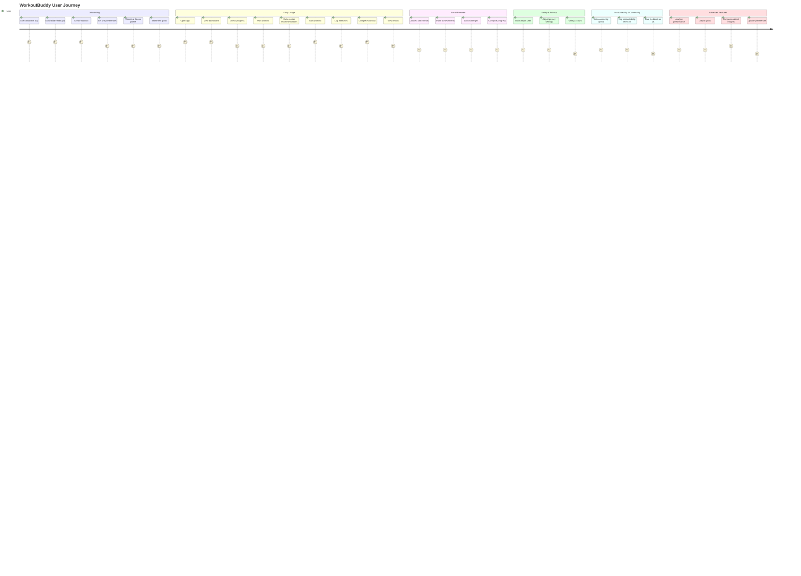
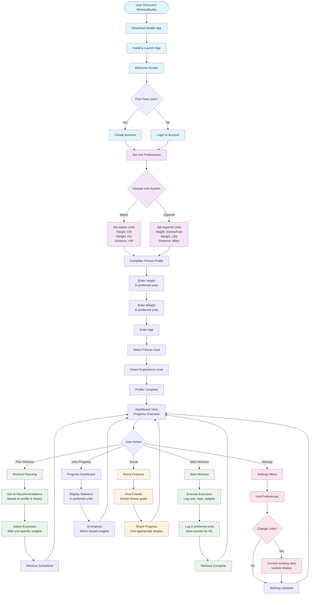
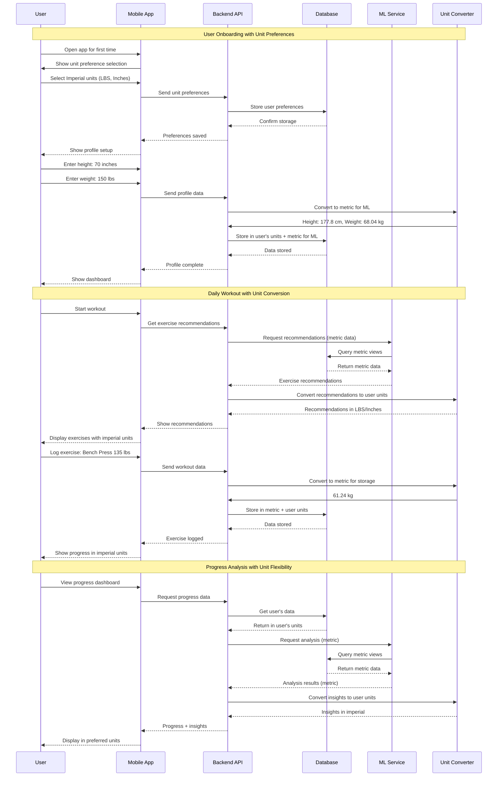
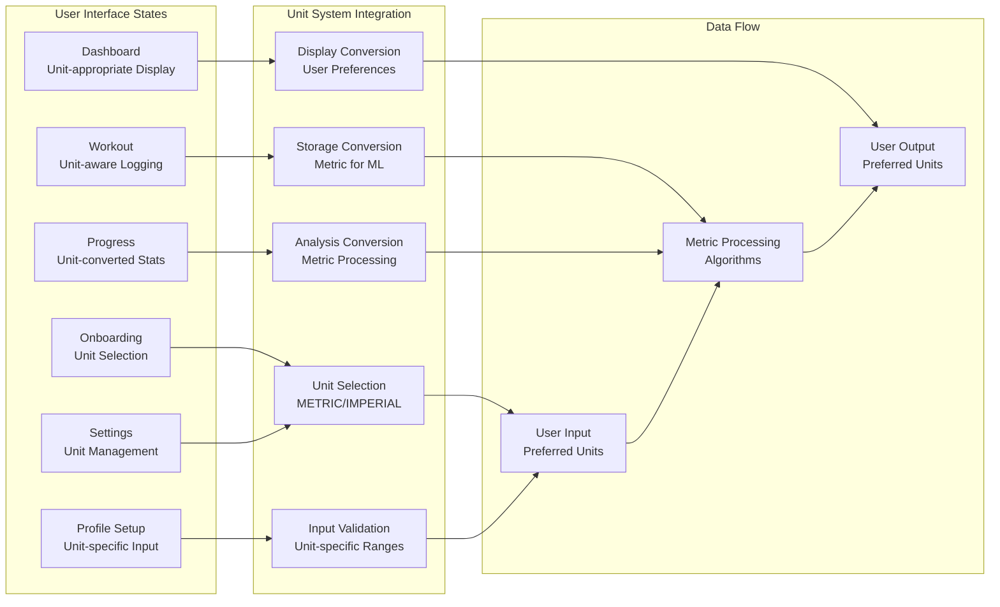
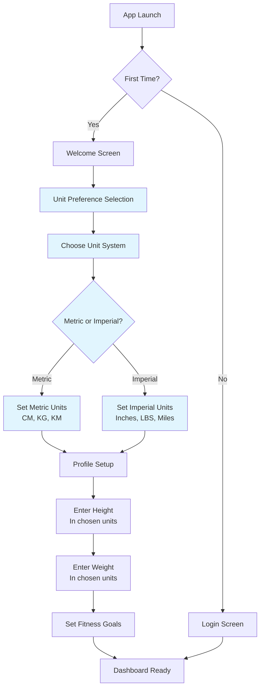
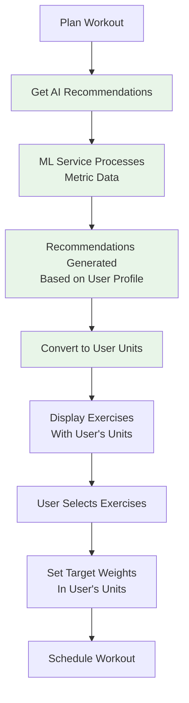
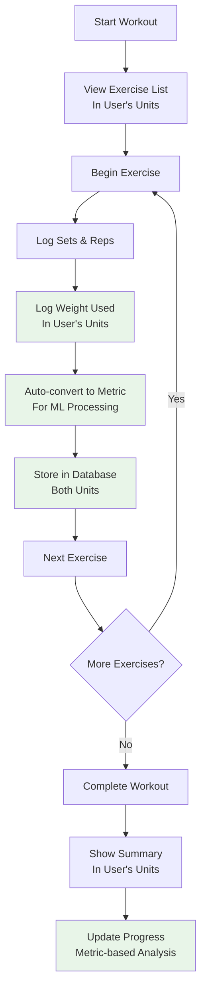
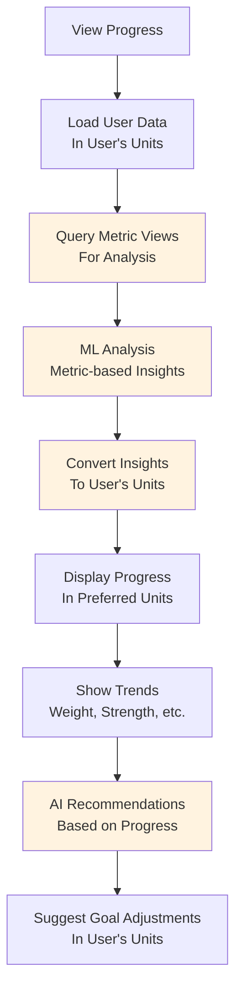
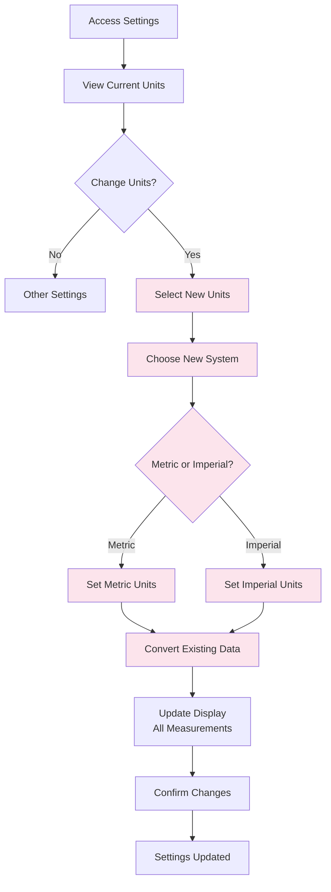

# WorkoutBuddy User Journey Diagram (2024)

## Overview

This document illustrates the complete user journey through the WorkoutBuddy application, including new flows for safety, privacy, ML feedback, accountability, and community. All flows are covered by synthetic test data and integration tests.

## Complete User Journey

## Test Coverage Note

All flows above are covered by synthetic test data and integration tests. Test data is annotated for easy separation and cleanup.

## Detailed User Journey Flow

## Unit System Integration Journey

## User Experience with Unit System

## Key User Journey Touchpoints

### 1. **Onboarding Experience**

### 2. **Workout Planning Journey**

### 3. **Workout Execution Journey**

### 4. **Progress Tracking Journey**

### 5. **Settings & Unit Management**

## User Journey Benefits

### 1. **Seamless Unit Experience**
- Users work in their preferred units throughout the entire journey
- Automatic conversion happens behind the scenes
- No confusion about unit systems

### 2. **Personalized Recommendations**
- ML algorithms use metric data for accuracy
- Recommendations are converted to user's preferred units
- Consistent and reliable suggestions

### 3. **Flexible Data Management**
- Users can change units at any time
- Historical data is preserved and converted
- No data loss when switching units

### 4. **Intuitive Interface**
- Unit selection during onboarding
- Unit-appropriate input validation
- Unit-converted display throughout the app

### 5. **Social Compatibility**
- Users can share progress in their preferred units
- Friends see data in their own units
- No unit confusion in social features

## Key Success Metrics

1. **User Adoption**: % of users who complete unit preference setup
2. **Unit Satisfaction**: User feedback on unit system experience
3. **Data Accuracy**: Reduction in unit-related errors
4. **Feature Usage**: Engagement with ML recommendations
5. **Retention**: User retention after unit preference changes

This user journey ensures that the dual unit system enhances rather than complicates the user experience, providing flexibility while maintaining accuracy and consistency throughout the application.